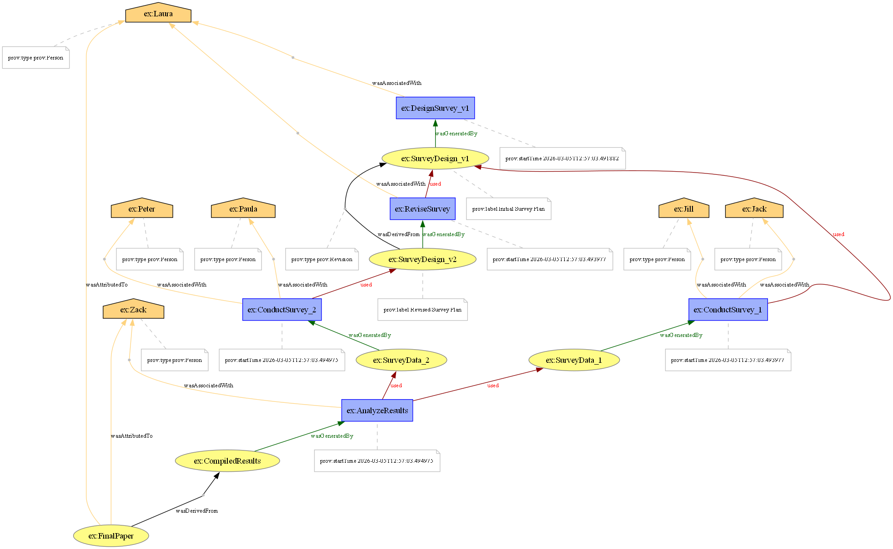

# The-Scientific-Paper-of-the-Future

> **Alexandru Lugnu**, (**2026**). *Seminar Assignment: Software and Provenance for Student Survey Analysis*. GitHub repository: `https://github.com/LunguLA/The-Scientific-Paper-of-the-Future`, version **1.0.0**, DOI: **10.5281/zenodo.18875965**, accessed **March 2026**.
>
> ## Project Overview
This repository contains the completed practical exercises for the "Scientific Paper of the Future" seminar. The project demonstrates best practices in software citation, metadata documentation, and research provenance.

---

## Exercise 1: Software Metadata and Citation
This repository follows the **FORCE11 Software Citation Principles**. 
* **License:** This project is licensed under the [MIT] License - see the [LICENSE](LICENSE) file for details.
* **Metadata:** Machine-readable metadata is provided in the `codemeta.json` file following the CodeMeta standard.
* **Archive:** A permanent snapshot of this repository is archived on Zenodo.

## Exercise 2: Research Provenance
To ensure transparency and reproducibility, the provenance of the survey data described in the seminar has been documented using the **W3C PROV standard**.

### Provenance Diagram
The following diagram illustrates the lifecycle of the survey, from Laura's initial design to the final paper published by Zack and Laura. It captures activities, entities (data/documents), and agents involved, including the critical revision step between Survey v1 and Survey v2.

*The provenance was generated programmatically using the `prov` Python library. You can view the execution trace in the `provenance_assignment.ipynb` notebook.*
